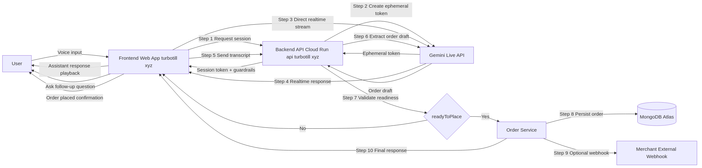

<div align="center">

# Turbo Till

### Realtime Gemini Live ordering assistant for modern food businesses

[](https://ai.google.dev/)
[](https://ai.google.dev/)
[](https://nodejs.org/)
[](https://react.dev/)
[](https://www.typescriptlang.org/)
[](https://cloud.google.com/run)

Turbo Tll turns natural customer conversations into structured, confirmed orders using Gemini Live.  
The platform includes a production-style dashboard, secure backend APIs, and Cloud Run deployment automation.

Live website: **https://turbotill.xyz/**

</div>

## Quick Links

- Challenge docs: [server/DEPLOY_CLOUD_RUN.md](./server/DEPLOY_CLOUD_RUN.md)
- Architecture: [server/docs/SYSTEM_ARCHITECTURE.md](./server/docs/SYSTEM_ARCHITECTURE.md)
- Deployment proof: [server/docs/proof/README.md](./server/docs/proof/README.md)
- Live website: [https://turbotill.xyz/](https://turbotill.xyz/)
- Frontend app source: [web](./web)
- Backend API source: [server](./server)

## Table of Contents

- [Challenge Scope](#challenge-scope)
- [Quick Judge Evaluation (2-3 Minutes)](#quick-judge-evaluation-2-3-minutes)
- [Demo Videos](#demo-videos)
- [Problem and Approach](#problem-and-approach)
- [Core Features](#core-features)
- [Architecture Overview](#architecture-overview)
- [Tech Stack](#tech-stack)
- [Repository Layout](#repository-layout)
- [Local Setup](#local-setup)
- [Testing and Validation](#testing-and-validation)
- [Cloud Deployment](#cloud-deployment)
- [Proof of Cloud Deployment](#proof-of-cloud-deployment)
- [API Surface](#api-surface)
- [Security Notes](#security-notes)
- [Devpost Checklist](#devpost-checklist)

## Challenge Scope

Built for the **Gemini Live Agent Challenge**, Turbo Tll focuses on three areas:

- **Live interaction**: customer talks naturally, Gemini responds in realtime.
- **Operational reliability**: order is created only when details are complete and confirmed.
- **Deployment readiness**: full Cloud Run path with build, secrets, diagnostics, and proof screenshots.

## Quick Judge Evaluation (2-3 Minutes)

### 1) Install dependencies

```bash
cd server && npm install
cd ../web && npm install
```

### 2) Configure backend environment

```bash
cd ../server
cp .env.production.example .env
```

Update `server/.env` with at least:

```env
NODE_ENV=development
PORT=4000
MONGODB_URI=<your_mongodb_uri>
FRONTEND_ORIGIN=http://localhost:5173
JWT_ACCESS_SECRET=<minimum_32_characters>
GEMINI_API_KEY=<your_gemini_api_key>
COOKIE_DOMAIN=
```

### 3) Configure frontend API base

Create `web/.env`:

```env
VITE_API_BASE_URL=http://localhost:4000/api/v1
```

### 4) Start backend and frontend

```bash
# terminal 1
cd server && npm run dev

# terminal 2
cd web && npm run dev
```

### 5) Open app

- `http://localhost:5173`

### 6) Validate one happy-path flow

1. Sign up or log in.
2. Create one product.
3. Create one live agent.
4. Use live conversation flow.
5. Confirm order is visible in Orders.

## Demo Videos

- Short demo (2:16): `https://youtu.be/X4aD-8gmd9I`
- Full walkthrough (10:23): `https://youtu.be/a3pylhs6SX8`

## Core Features

- Realtime Gemini Live session issuance from backend
- Conversation-to-order extraction endpoint
- Public table ordering endpoints
- Agent and product management dashboard
- Orders tracking and status workflows
- Audit logs and exports
- Secure auth with refresh-token rotation and CSRF
- Role-based permissions (`owner`, `admin`, `manager`, `viewer`)
- Cloud Run deployment scripts and access diagnostics

## Architecture Overview

Primary architecture docs:

- [server/docs/SYSTEM_ARCHITECTURE.md](./server/docs/SYSTEM_ARCHITECTURE.md)
- [server/docs/assets/gemini-live-system-flow.png](./server/docs/assets/gemini-live-system-flow.png)
- [server/docs/assets/gemini-live-system-flow.svg](./server/docs/assets/gemini-live-system-flow.svg)

System flow preview:



Simplified runtime path:

```text
User -> Frontend (React) -> Backend (Express) -> Gemini Live API
     <- live response stream  <-
Frontend -> Backend conversation-order endpoint -> MongoDB order creation -> confirmation
```

## Tech Stack

### Frontend (`web/`)

- React 19
- TypeScript
- Vite

### Backend (`server/`)

- Node.js + Express 5
- TypeScript
- Mongoose + MongoDB
- Zod validation

### AI Integration

- `@google/genai`
- Gemini Live for conversational sessions
- Gemini extraction models for structured order draft processing

### Cloud

- Cloud Build
- Artifact Registry
- Cloud Run
- Secret Manager

## Repository Layout

```text
.
├── web/                     # Frontend UI and route layer
├── server/                  # Backend API, services, scripts, tests
│   ├── docs/                # Architecture and deployment proof docs
│   ├── scripts/             # GCP deployment and diagnostics scripts
│   └── tests/               # Integration tests
└── cloudbuild.yaml          # Cloud Build pipeline used by bootstrap deploy
```

## Local Setup

### Prerequisites

- Node.js 20+
- npm 10+
- MongoDB URI (local or Atlas)
- Gemini API key

### Backend setup

```bash
cd server
npm install
cp .env.production.example .env
npm run dev
```

### Frontend setup

```bash
cd web
npm install
npm run dev
```

Set `VITE_API_BASE_URL` in `web/.env` as shown above.

## Testing and Validation

### Backend

```bash
cd server
npm run typecheck
npm run test:integration
```

### Frontend

```bash
cd web
npm run lint
npm run build
```

### Health checks

- `GET http://localhost:4000/healthz`
- `GET http://localhost:4000/health`
- `GET http://localhost:4000/api/v1/health`

## Cloud Deployment

Main deployment documentation:

- [server/DEPLOY_CLOUD_RUN.md](./server/DEPLOY_CLOUD_RUN.md)

One-command bootstrap deployment from `server/`:

```bash
GCP_PROJECT_ID=<PROJECT_ID> npm run gcp:bootstrap-deploy
```

Useful operational commands:

```bash
GCP_PROJECT_ID=<PROJECT_ID> npm run gcp:service:url
GCP_PROJECT_ID=<PROJECT_ID> npm run gcp:service:describe
GCP_PROJECT_ID=<PROJECT_ID> npm run gcp:service:logs
GCP_PROJECT_ID=<PROJECT_ID> npm run gcp:access:check
```

## Proof of Cloud Deployment

Proof screenshots and details:

- [server/docs/proof/README.md](./server/docs/proof/README.md)
- `server/docs/proof/Cloud Run service.png`
- `server/docs/proof/Cloud Build history.png`
- `server/docs/proof/Cloud Build latest detail.png`
- `server/docs/proof/Artifact Registry.png`
- `server/docs/proof/Secret Manager.png`

## API Surface

Base path: `/api/v1`

- `/health` - API health route
- `/auth` - authentication and sessions
- `/products` - product lifecycle management
- `/agents` - agent management + live session/order endpoints
- `/orders` - order listing and status updates
- `/settings` - profile and workspace settings
- `/audit-logs` - audit retrieval and export

## Security Notes

The backend includes core production protections:

- JWT access token + refresh token rotation
- CSRF validation for state-changing requests
- Role-based authorization checks
- Helmet, CORS configuration, and rate limiting
- Secret Manager integration for deployment secrets