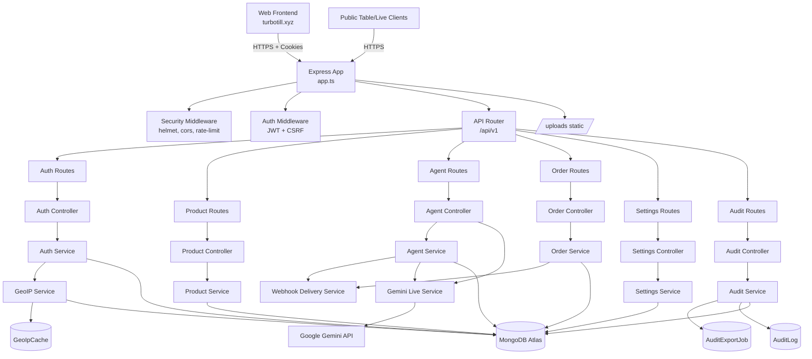
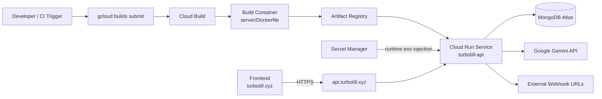
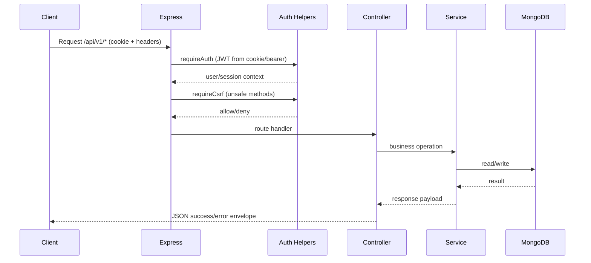
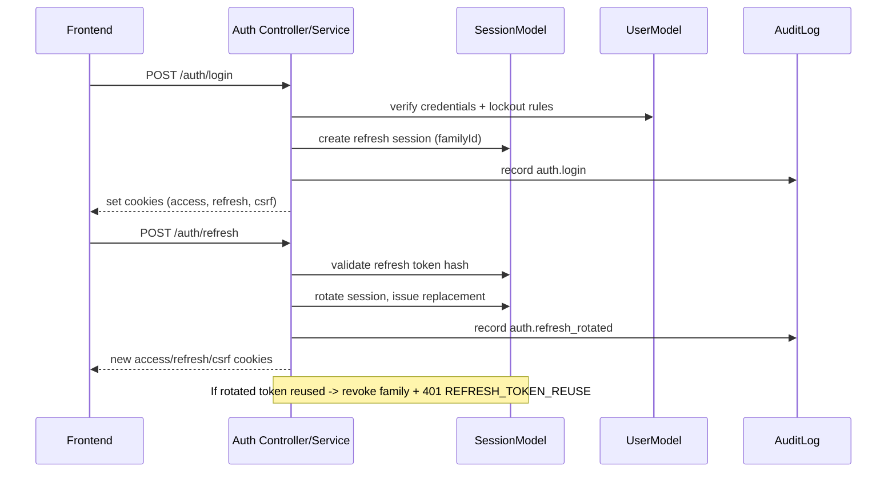
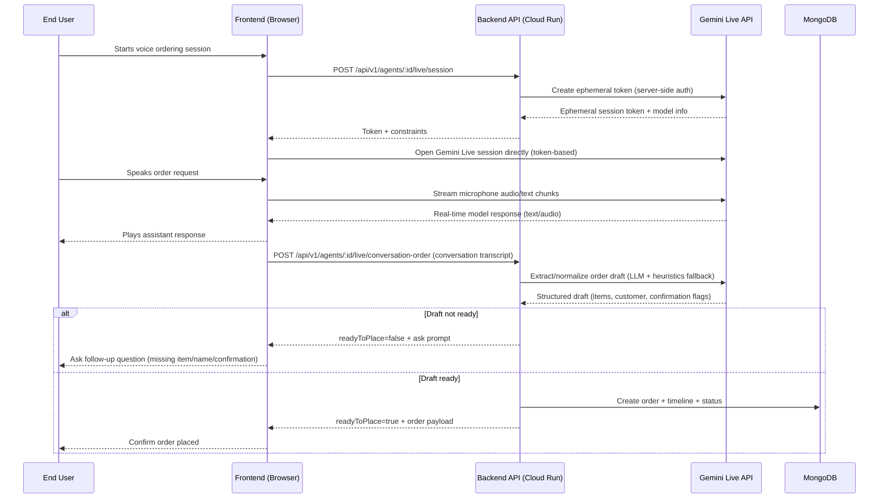
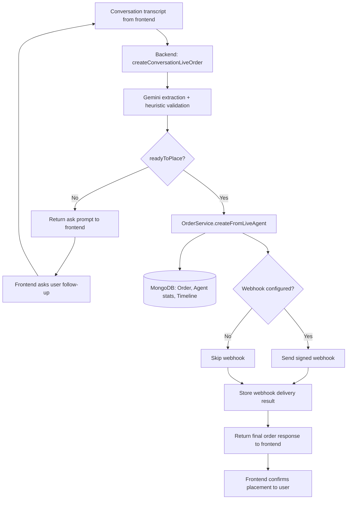
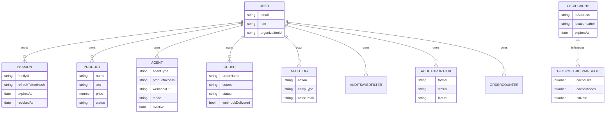

# Turbo Tll Backend System Architecture

Challenge: **Gemini Live Agent Challenge**

This document explains how the backend works end-to-end: API layers, data flow, background workers, and Cloud Run deployment architecture.

## 1) Backend High-Level Architecture



## 2) Cloud Run Deployment Architecture



## 3) Startup and Runtime Lifecycle

1. `server.ts` bootstraps process:
   - connect MongoDB
   - start audit export worker
   - start geo cache metrics monitor
   - start HTTP server on `0.0.0.0:${PORT}`
2. `app.ts` initializes middleware and routes:
   - request logging (`pino-http`)
   - security headers (`helmet`)
   - CORS with `FRONTEND_ORIGIN`
   - global rate limit
   - cookie parser + JSON/form parsing
   - static upload serving (`/${UPLOAD_DIR}`)
   - health endpoints: `/healthz`, `/health`, `/api/v1/health`
3. Graceful shutdown on `SIGINT/SIGTERM`:
   - stop workers
   - disconnect MongoDB
   - enforce shutdown timeout guard

## 4) Request Pipeline (Protected API)



## 5) Authentication and Session Rotation



## 6) Gemini Live Agent End-to-End Flow

### 6.0 One-View System Diagram (Frontend + Backend + Gemini + Order Creation)

Exported assets:

- PNG: `./assets/gemini-live-system-flow.png`
- SVG: `./assets/gemini-live-system-flow.svg`
- Mermaid source: `./diagrams/gemini-live-system-flow.mmd`


```mermaid
flowchart LR
    U[User] -->|Voice/Text input| FE[Frontend Web App]
    FE -->|1) Request ephemeral session| BE[Backend API on Cloud Run]
    BE -->|2) Server-authenticated token creation| GL[Gemini Live API]
    GL -->|Ephemeral token| BE
    BE -->|Session token + guardrails| FE

    FE -->|3) Direct realtime stream| GL
    GL -->|4) Realtime response text/audio| FE
    FE -->|Assistant response playback/UI update| U

    FE -->|5) Send transcript + metadata| BE
    BE -->|6) Extract structured order draft| GL
    GL -->|Order draft| BE
    BE -->|7) Validate readiness| DEC{readyToPlace?}
    DEC -- No --> FE
    FE -->|Ask follow-up question| U
    DEC -- Yes --> OS[Order Service]
    OS -->|8) Persist order + timeline| DB[(MongoDB)]
    OS -->|9) Optional webhook notification| WH[Merchant/External Webhook]
    OS -->|10) Final order response| FE
    FE -->|Order placed confirmation| U
```

### 6.1 Frontend + Backend + Gemini Live Interaction



### 6.2 How Order Placement Completes



Key behavior:

- Backend is responsible for secure Gemini token issuance and order finalization.
- Frontend handles real-time user interaction (audio capture/playback and conversation UX).
- Order creation only happens after `readyToPlace=true` with valid items + customer name + confirmation.

## 7) Audit Export and Background Workers

```mermaid
flowchart TD
    R1[Audit API request] --> S1[Audit Service]
    S1 -->|small export| I1[Inline CSV/JSON response]
    S1 -->|large export| J1[Create AuditExportJob pending]

    W1[Background Export Worker Timer] --> P1[Scan pending jobs]
    P1 --> P2[Generate export file]
    P2 --> F1[/uploads/exports]
    P2 --> D1[(AuditExportJob status=completed)]

    W2[Geo Cache Monitor Timer] --> M1[Snapshot counters]
    M1 --> D2[(GeoIpMetricSnapshot)]
    M1 --> C1[Cleanup expired GeoIpCache]
```

## 8) Route Domains

- `Auth`: signup/login/refresh/logout/session management/org users
- `Products`: CRUD + bulk create (owner/admin/manager)
- `Agents`: CRUD, toggle, webhook test, live session/order endpoints, public table/live endpoints
- `Orders`: list/detail/create/status updates
- `Settings`: profile/workspace updates + avatar/logo upload
- `Audit`: logs, filters, exports, export jobs, geo-cache metrics

## 9) Core Persistence Models



## 10) Security and Operational Controls

- JWT access tokens + refresh token rotation
- CSRF validation with trusted-origin compatibility fallback
- Role-based authorization (`owner/admin/manager/viewer`)
- Helmet + rate limiting + request/body size limits
- Pino logging with redaction for auth/cookie/password fields
- Upload MIME/type + file-size restrictions
- Structured error mapping (`ApiError`, Zod, Mongoose, Multer)

## 11) Where to Start in Code

- Entry and middleware: `server.ts`, `app.ts`
- Route composition: `src/routes/index.ts`
- Auth/session security: `src/services/auth.service.ts`, `src/helpers/auth.ts`
- Live order orchestration: `src/controllers/agent.controller.ts`, `src/services/gemini-live.service.ts`, `src/services/order.service.ts`
- Auditing/export workers: `src/services/audit.service.ts`
- GeoIP cache/metrics: `src/services/geoip.service.ts`, `src/services/geo-cache-monitor.service.ts`
